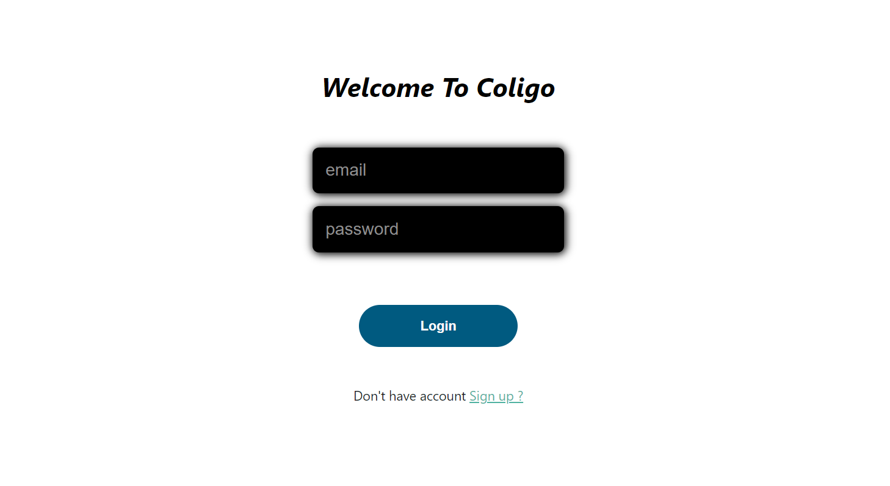
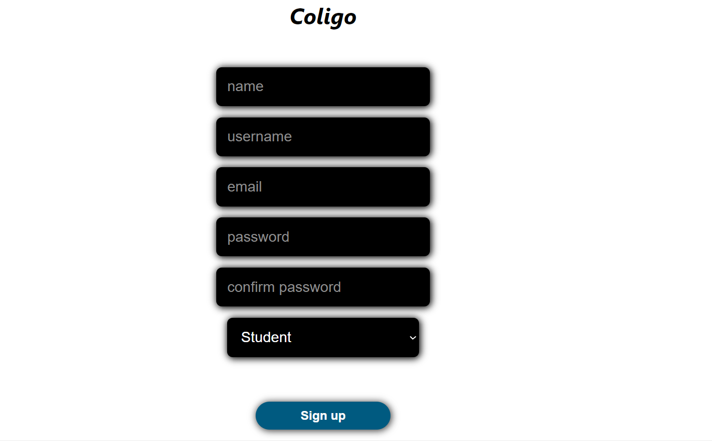
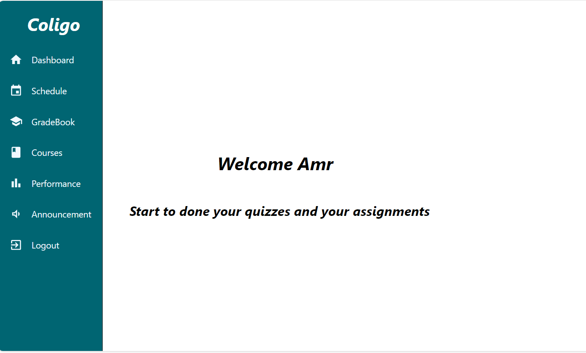
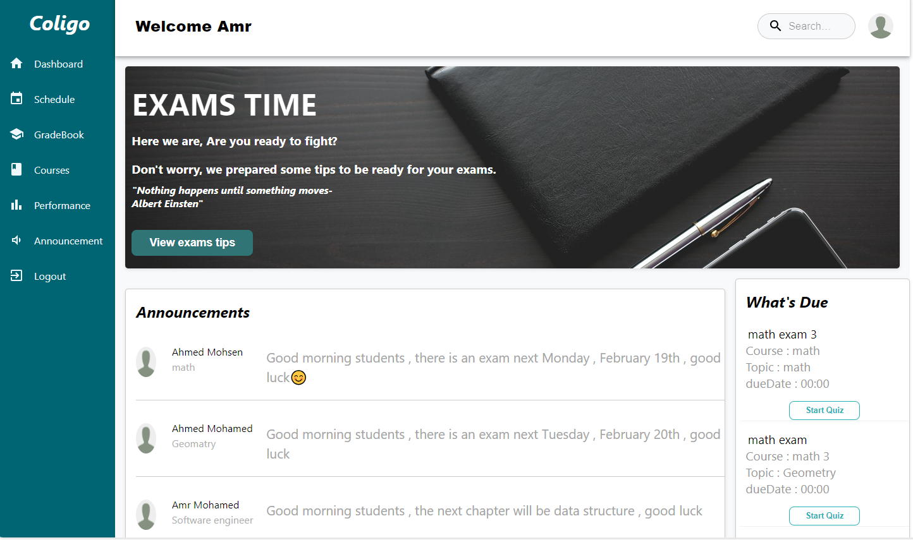

# Full-stack application

## Description

This project present student quizzes and announcments data for the current semestet .

This full stack project  
◼ I used (react , typescript) in frontend .
◼ I used (node , express , mongoDB , typescript) in backend .

## Screenshots

